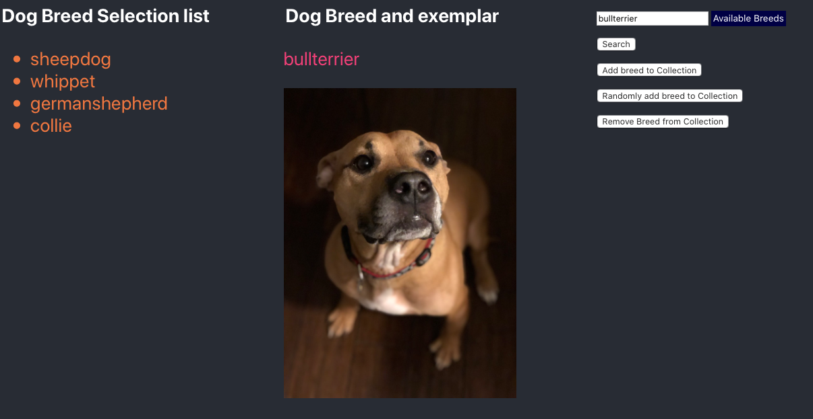

##Minimal React webpage to keep track of pictures of dog breeds.

Install the React app.

```
cd Minimal_React_webpage
npm install`
```

Runs the app in the development mode.

`yarn start`

Open [http://localhost:3000](http://localhost:3000) to view it in the browser.

###Notes

The webpage is composed of three columns:

- Dog Breed Selection List,
- Dog Breed name and exemplar
- search textfield and dropdown menu on its right hand side, four buttons:
	-  to search for a specific dog breed image,
	-  to add a breed to the selection list,
	-  also randomly a breed to the selection list,
	-  and to remove a breed from the selection list.

NB: The textfield allows for direct typing in or being filled in through clicking on a dropdown item, or, from clicking the random addition of a breed. An image is loaded only after clicking on the Search button.




